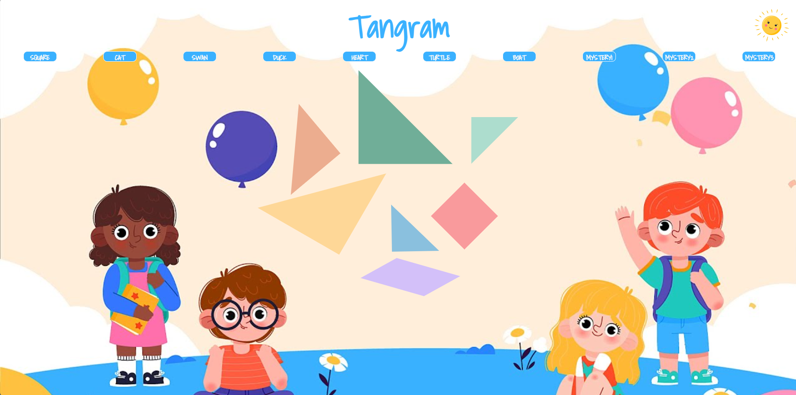

# 🎲 Jouer à Transmettre - Tangram Animé

Créez et animez des figures de tangram pour les faire deviner à d'autres joueurs.  
Le projet inclut un **dark mode**, des animations CSS, et permet de changer de modèle facilement.

---

## 🌟 Présentation du projet

Ce projet a pour objectif de faciliter la découverte du **jeu du tangram** auprès d’un jeune public.  
L’application permet à "la voix" de montrer un modèle et à "la main" de le reproduire uniquement guidée par les instructions verbales.  

Fonctionnalités principales :
- Sélection et affichage de modèles de tangram animés
- Animation fluide entre les différents modèles
- Dark mode pour un confort visuel
- Accessible sur desktop (non responsive pour le moment)

---

## 🎯 Objectifs et apprentissages

- Créer et animer des figures géométriques en **CSS**
- Gérer plusieurs modèles et transitions entre eux
- Apprendre à collaborer efficacement en **groupe** avec Git
- Développer un jeu interactif pour un usage pédagogique
- Expérimenter la répartition des rôles : "la voix", "la main", "les yeux"

---

## 🛠️ Technologies utilisées

| Outil / Langage | Rôle |
|-----------------|------|
| **HTML5**       | Structure du jeu |
| **CSS3**        | Figures, animations et dark mode |
| **JavaScript**  | Gestion des boutons et changement de modèles |
| **Git / GitHub**| Collaboration et intégration continue |
| **GitHub Pages**| Déploiement en ligne |

---

## 💻 Fonctionnalités principales

✅ Figures animées de tangram  
✅ Possibilité de changer de modèle via des boutons  
✅ Dark mode activable  
✅ Jeux pédagogiques avec rôles "voix", "main" et "yeux"  

---

## 🚀 Démo en ligne

🔗 [Accéder au Tangram](https://julie-charles16.github.io/tangram/)

---

## 🧭 Améliorations envisagées

- Ajouter le **responsive design** pour les tablettes et mobiles  
- Ajouter de nouveaux modèles et animations  
- Améliorer l’accessibilité des interactions  

---

## 👩‍💻 À propos

Ce projet a été réalisé en **groupe de 3** dans le cadre de ma formation **Développeuse Web & Web Mobile** chez **Simplon Hauts-de-France**.  

📍 **Autrice et contributrice :** [Julie Charles](https://github.com/Julie-Charles16)  
🤝 **Collaborateurs :** [Legrand Aledorian](https://github.com/) & [Maryline Lesaffre](https://github.com/)  

💬 “Un projet ludique qui m’a permis de développer mes compétences en CSS et en collaboration de groupe.”

---

## 🧑‍🏫 Projet original fourni par

* [Nicolas Herbez](https://github.com/NicolasHerbez) — projet pédagogique de départ.
